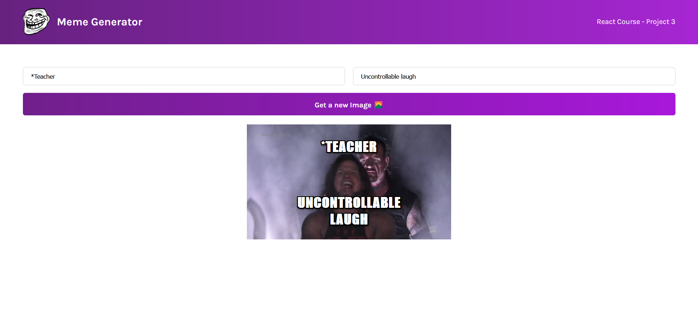
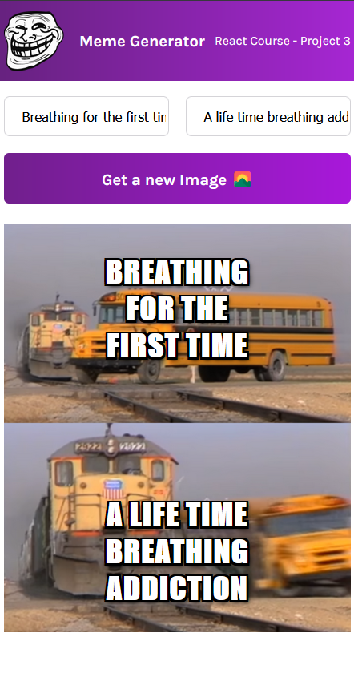

# Meme Generator

This is a basic meme generator website that allows users to create memes. Users can choose from a variety of popular meme templates generate unique and funny memes. The website provides an intuitive and user-friendly interface, making it easier for users.

## Table of Contents

- [Features](#features)
- [Screenshots](#screenshots)
- [Requirements](#requirements)
- [Installation](#installation)
- [What I Learned](#what-i-learned)
- [Acknowledgements](#acknowledgements)
- [Contact](#contact)

## Features

- **Meme Templates**: The website offers a collection of popular meme templates that users can choose from. These templates cover a wide range of categories and themes, ensuring there's something for everyone.

- **Text Customization**: Users can add desired text to their memes

- **Two Text**: Users are able to input two texts. Similar to setup and punchline.

## Screenshots




## Requirements

- Web browser with JavaScript support
- Internet connection

## Installation

1. Clone the repository:

```terminal
git clone https://github.com/rojansr/meme-generator.git
```

2. Navigate to the project directory:

```terminal
cd meme-generator
```

3. Make sure npm is already installed

```terminal
npm -v
```

4. Run

```terminal
npm run dev
```

## What I Learned

During the development of this meme generator website, I gained hands-on experience with the following:

- Application of React useState and useEffect hooks.
- Updating forms on user input
- Building a responsive and user-friendly website interface.

This project allowed me to enhance my web development skills and understand the intricacies of creating an interactive web application.

## Acknowledgements

The meme templates used in this website are fetched from imgflip.com

## Contact

Email: [rairojan1116@gmail.com](mailto:rairojan1116@gmail.com)
